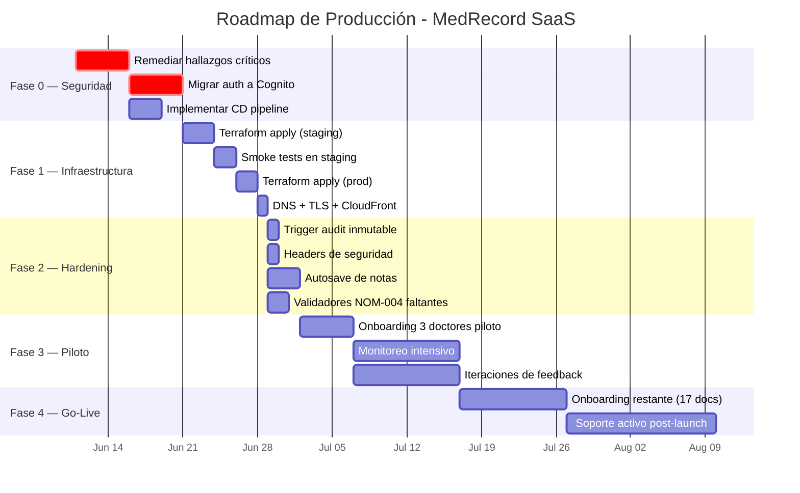
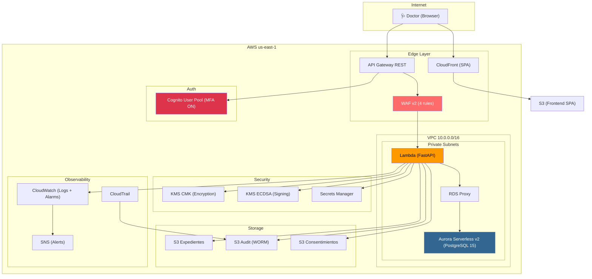

# 🚀 Roadmap de Producción — MedRecord SaaS

> **Escenario objetivo:** 20 médicos independientes en México  
> **Filosofía:** Simple, barato, seguro. Datos sensibles tratados con rigor.  
> **Framework:** AWS Well-Architected — Prioritizando Seguridad > Fiabilidad > Costo  
> **Fecha:** 10 de junio de 2026

---

## Contexto y Restricciones

| Parámetro | Valor |
|-----------|-------|
| Usuarios concurrentes (pico) | ~10 médicos simultáneos |
| Pacientes estimados (año 1) | ~2,000–4,000 registros |
| Notas médicas estimadas (año 1) | ~15,000–30,000 |
| Disponibilidad objetivo | 99.5% (≈ 44 horas de downtime/año) |
| RPO (Recovery Point Objective) | < 5 minutos |
| RTO (Recovery Time Objective) | < 1 hora |
| Presupuesto AWS mensual objetivo | $80–$150 USD/mes |
| Ingresos objetivo (20 docs × ~$30 USD) | ~$600 USD/mes |

---

## Estimación de Costos AWS (20 doctores)

| Servicio | Configuración | Costo Estimado/Mes |
|----------|--------------|---------------------|
| **Aurora Serverless v2** | 0.5–4 ACU, 10 GB storage | $43–$55 |
| **Lambda** | ~50K invocaciones/mes, 1024 MB | $2–$5 |
| **API Gateway** | ~50K requests/mes | $0.20 |
| **Cognito** | 20 MAUs (free tier: 50K) | **$0** |
| **KMS** | 2 CMKs + ~10K API calls | $2.30 |
| **S3** | ~5 GB total (3 buckets) | $0.15 |
| **NAT Gateway** | 1 (single AZ) | $32 |
| **CloudFront** | SPA distribution | $1–$3 |
| **Route53** | 1 hosted zone + health check | $1.50 |
| **WAF** | 4 reglas, ~50K requests | $6 |
| **CloudTrail** | 1 trail, management events | $0 (free tier) |
| **Secrets Manager** | 2 secrets | $0.80 |
| **RDS Proxy** | 1 instancia | **$0** (included with Aurora) |
| **SNS** | Alertas (bajo volumen) | $0 |
| **SQS** | DLQ (bajo volumen) | $0 |
| **Certificados ACM** | TLS para dominio | **$0** |
| | **TOTAL ESTIMADO** | **$90–$105 USD/mes** |

> [!TIP]
> **Ahorro potencial:** Reemplazar NAT Gateway por VPC Endpoints (KMS, S3, Secrets Manager, CloudWatch Logs) reduce ~$30/mes. Esto lleva el costo a **$60–$75 USD/mes**.

---

## Fases del Roadmap



---

## Fase 0 — Remediación de Seguridad (Semana 1-2)

> **Objetivo:** Cerrar todos los hallazgos 🔴 del [PRODUCTION_AUDIT.md](file:///Users/franciscofloresenriquez/expedienteMedico/PRODUCTION_AUDIT.md).  
> **Criterio de salida:** 0 hallazgos críticos abiertos.

### 0.1 Hardening del código (Días 1-3)

| Tarea | Archivo(s) | Esfuerzo |
|-------|------------|----------|
| Eliminar JWT secret hardcodeado | [security.py](file:///Users/franciscofloresenriquez/expedienteMedico/backend/app/core/security.py), [auth.py](file:///Users/franciscofloresenriquez/expedienteMedico/backend/app/api/v1/auth.py) | 2h |
| `git rm --cached` el `.env.local` | [.env.local](file:///Users/franciscofloresenriquez/expedienteMedico/backend/.env.local) | 30min |
| Cambiar default de `environment` a `"production"` | [config.py](file:///Users/franciscofloresenriquez/expedienteMedico/backend/app/core/config.py#L22) | 15min |
| Restringir CORS headers | [main.py](file:///Users/franciscofloresenriquez/expedienteMedico/backend/app/main.py#L44) | 15min |
| Validar UUIDs en path params | Todos los routers en [api/v1/](file:///Users/franciscofloresenriquez/expedienteMedico/backend/app/api/v1) | 2h |
| Agregar rate limiting en auth | [auth.py](file:///Users/franciscofloresenriquez/expedienteMedico/backend/app/api/v1/auth.py) | 3h |
| Crear trigger de inmutabilidad para audit_log | [rls_init.sql](file:///Users/franciscofloresenriquez/expedienteMedico/backend/app/db/rls_init.sql) | 1h |

### 0.2 Migración a Cognito (Días 4-8)

| Tarea | Detalle |
|-------|---------|
| **Backend: Eliminar auth local** | Borrar la emisión de JWT en `auth.py`. El backend solo valida el JWKS de Cognito (ya implementado en [security.py](file:///Users/franciscofloresenriquez/expedienteMedico/backend/app/core/security.py#L98-L149)). |
| **Backend: Endpoint de registro** | Reemplazar `POST /auth/register` por una llamada a `cognito:AdminCreateUser` + `AdminSetUserPassword`. |
| **Frontend: Integrar AWS Amplify Auth** | Reemplazar `localStorage` tokens por Amplify auth. Manejar MFA en el flujo de login. |
| **Frontend: Refresh silencioso** | Usar Amplify para manejar automáticamente el refresh del access token cada 15 min. |
| **Test E2E** | Verificar que el flujo Register → Login → MFA → Dashboard funciona completo. |

### 0.3 Pipeline de CD (Días 3-5, paralelo)

| Componente | Herramienta |
|------------|------------|
| **Deploy backend** | GitHub Actions: `zip` → `aws lambda update-function-code` |
| **Deploy frontend** | GitHub Actions: `npm build` → `aws s3 sync` → `aws cloudfront create-invalidation` |
| **Deploy infra** | GitHub Actions: `terraform plan` (en PR) → `terraform apply` (en merge a main, con approval) |
| **Environments** | GitHub Environments: `staging` (auto-deploy) → `production` (manual approval) |
| **Rollback** | Lambda: revert a versión anterior. Frontend: S3 versioning. Aurora: PITR. |

---

## Fase 1 — Despliegue de Infraestructura (Semana 3)

> **Objetivo:** Levantar toda la infraestructura en AWS con Terraform.

### 1.1 Crear `terraform/environments/dev/main.tf`

Orquestar todos los módulos:

```hcl
module "networking"    { source = "../../modules/networking"    environment = "dev" }
module "auth"          { source = "../../modules/auth"          environment = "dev" }
module "security"      { source = "../../modules/security"      environment = "dev" ... }
module "database"      { source = "../../modules/database"      environment = "dev" ... }
module "storage"       { source = "../../modules/storage"        environment = "dev" ... }
module "compute"       { source = "../../modules/compute"        environment = "dev" ... }
module "observability" { source = "../../modules/observability"  environment = "dev" ... }
```

### 1.2 Crear `terraform/environments/prod/main.tf`

Idéntico pero con `environment = "prod"` y valores de producción (deletion_protection = true, etc.).

### 1.3 State Backend

Configurar Terraform remote state en S3 + DynamoDB lock:

```hcl
terraform {
  backend "s3" {
    bucket         = "medrecord-terraform-state"
    key            = "prod/terraform.tfstate"
    region         = "us-east-1"
    dynamodb_table = "terraform-locks"
    encrypt        = true
  }
}
```

### 1.4 Pasos de despliegue

```
1. terraform init
2. terraform plan -out=plan.tfplan
3. Revisión humana del plan
4. terraform apply plan.tfplan
5. Ejecutar rls_init.sql + trigger de inmutabilidad contra Aurora
6. Crear usuario admin en Cognito
7. Deploy Lambda (zip + update-function-code)
8. Deploy frontend a S3 + CloudFront
9. Configurar dominio personalizado (medrecord.mx o similar)
10. Smoke test del endpoint /health
```

### 1.5 DNS y TLS

| Recurso | Configuración |
|---------|--------------|
| **Dominio** | `app.medrecord.mx` (frontend) + `api.medrecord.mx` (backend) |
| **ACM** | Certificado wildcard `*.medrecord.mx` (gratuito con validación DNS) |
| **CloudFront** | Distribución para SPA con custom domain y certificado ACM |
| **Route53** | ALIAS records apuntando a CloudFront y API Gateway |

---

## Fase 2 — Hardening (Semana 4)

> **Objetivo:** Agregar las capas de protección faltantes.

### 2.1 Headers de seguridad

Agregar en CloudFront (Response Headers Policy):

```json
{
  "Content-Security-Policy": "default-src 'self'; script-src 'self'; style-src 'self' 'unsafe-inline' https://fonts.googleapis.com; font-src https://fonts.gstatic.com; connect-src 'self' https://api.medrecord.mx; img-src 'self' data:",
  "Strict-Transport-Security": "max-age=63072000; includeSubDomains; preload",
  "X-Content-Type-Options": "nosniff",
  "X-Frame-Options": "DENY",
  "Referrer-Policy": "strict-origin-when-cross-origin"
}
```

### 2.2 Autosave de borradores de notas

```
Frontend:
- Cada 30 segundos, guardar el estado del formulario de nota en localStorage.
- Al abrir el formulario, verificar si existe un borrador y ofrecer recuperarlo.
- Al enviar exitosamente la nota al backend, limpiar el borrador local.
- Mostrar indicador visual: "Guardado localmente hace X segundos".
```

### 2.3 Completar validadores NOM-004

Agregar validadores faltantes en [nom_validator.py](file:///Users/franciscofloresenriquez/expedienteMedico/backend/app/core/nom_validator.py):
- `ingreso`
- `egreso`
- `quirurgica`
- `anestesiologia`
- `historia_clinica`

### 2.4 Monitoreo de compliance

1. CloudWatch Metric Filter para `"CRITICAL: Failed to persist audit"` → Alarma SNS.
2. Agregar `pip-audit` y `npm audit` al pipeline CI.
3. Habilitar Dependabot en el repositorio de GitHub.

---

## Fase 3 — Piloto Controlado (Semana 5-7)

> **Objetivo:** Validar con 3 médicos reales antes del lanzamiento general.

### 3.1 Criterios de selección de pilotos

- Médicos de confianza o early adopters que estén dispuestos a dar feedback.
- Preferentemente con diferentes especialidades para cubrir distintos tipos de notas.
- Idealmente en la misma zona horaria para facilitar soporte.

### 3.2 Protocolo de onboarding

```
Para cada doctor piloto:
1. Crear cuenta en Cognito (AdminCreateUser + MFA setup)
2. Sesión de onboarding de 30 min por videollamada:
   a. Firmar Aviso de Privacidad del servicio (SaaS ↔ Doctor)
   b. Configurar Aviso de Privacidad del doctor (Doctor ↔ Paciente)
   c. Demo en vivo: crear paciente → expediente → nota → firma
   d. Explicar el flujo de consentimiento informado
3. Periodo de prueba: 1 semana (datos de prueba)
4. Transición a datos reales con acompañamiento
```

### 3.3 Monitoreo intensivo (2 semanas)

| Métrica | Alarma si |
|---------|-----------|
| Error rate Lambda | > 2% |
| Latencia p99 API | > 3 segundos |
| Fallos de audit persistencia | > 0 |
| CPU Aurora | > 70% sostenido |
| DLQ messages | > 0 |
| Cognito sign-in failures | > 10/hora |

### 3.4 Canales de soporte

| Canal | Herramienta | Costo |
|-------|-------------|-------|
| Soporte directo | WhatsApp Business (grupo por doctor) | $0 |
| Bug tracking | GitHub Issues (privado) | $0 |
| Documentación | Notion o README actualizado | $0 |

---

## Fase 4 — Go-Live General (Semana 8-10)

> **Objetivo:** Onboarding de los 17 médicos restantes.

### 4.1 Automatizar onboarding

Crear un script de CLI o endpoint admin que:
1. Crea el tenant en la BD.
2. Crea el usuario en Cognito.
3. Genera el DEK con KMS.
4. Envía email de bienvenida con link de primer acceso.

### 4.2 Plan de comunicación

```
Semana 8: Invitaciones personalizadas a los 17 doctores
Semana 8-9: Sesiones de onboarding (3-4 doctores por sesión)
Semana 9-10: Soporte activo post-launch
Semana 11: Primera retrospectiva y ajustes
```

### 4.3 Métricas de éxito (30 días post-launch)

| Métrica | Objetivo |
|---------|----------|
| Doctores activos (weekly) | ≥ 15/20 (75%) |
| Notas firmadas digitalmente | ≥ 80% de las notas creadas |
| Uptime | ≥ 99.5% |
| Incidentes de seguridad | 0 |
| Fallos de auditoría | 0 |
| NPS (encuesta de satisfacción) | ≥ 7/10 |

---

## Checklist Legal Pre-Lanzamiento

- [ ] **Aviso de Privacidad del SaaS** — Publicar en `app.medrecord.mx/privacidad` (ya existe template).
- [ ] **Términos de Servicio** — Redactar contrato SaaS ↔ Doctor con cláusulas de:
  - Responsabilidad compartida (el doctor es "responsable" LFPDPPP; el SaaS es "encargado").
  - SLA (99.5% uptime, soporte en horario laboral).
  - Backup y recuperación.
  - Propiedad de los datos (del doctor/paciente, no del SaaS).
  - Cláusula de salida (exportación de datos en formato estándar).
- [ ] **Contrato de Encargado de Datos** — Requerido por LFPDPPP cuando un tercero trata datos sensibles en nombre del responsable.
- [ ] **Registro ante INAI** — Verificar si es necesario registrar la base de datos de datos personales.
- [ ] **Póliza de seguro** — Considerar un seguro de responsabilidad civil profesional para errores de software.
- [ ] **Protocolo de brecha** — Ya existe ([breach_protocol.md](file:///Users/franciscofloresenriquez/expedienteMedico/docs/legal/breach_protocol.md)). Completar con nombres reales y datos de contacto.

---

## Arquitectura de Producción (Diagrama)



---

## Estimación de Tiempo Total

| Fase | Duración | Personas |
|------|----------|----------|
| Fase 0 — Seguridad | 2 semanas | 1 dev full-time |
| Fase 1 — Infraestructura | 1 semana | 1 dev (DevOps) |
| Fase 2 — Hardening | 1 semana | 1 dev |
| Fase 3 — Piloto | 2 semanas | 1 dev + soporte |
| Fase 4 — Go-Live | 2 semanas | 1 dev + soporte |
| **TOTAL** | **~8 semanas** | **1 persona** |

---

## Riesgos y Mitigaciones

| Riesgo | Probabilidad | Impacto | Mitigación |
|--------|-------------|---------|------------|
| Doctor pierde conexión durante nota | Alta | Medio | Autosave local (Fase 2.2) |
| Brecha de datos | Baja | Crítico | Encryption + RLS + WAF + audit trail |
| Aurora falla (AZ outage) | Baja | Alto | Aurora multi-AZ automático + PITR 35 días |
| Costo AWS se dispara | Baja | Medio | Billing alerts a $100, $150, $200 |
| Doctor no adopta el sistema | Media | Alto | Onboarding personalizado + soporte WhatsApp |
| Cambio regulatorio (COFEPRIS/DGIS) | Baja | Medio | Arquitectura modular permite adaptar rápido |

---

## Próximos Pasos Inmediatos

1. ✅ Leer y aprobar este roadmap.
2. 🔧 Comenzar Fase 0.1 (hardening del código) — **hoy mismo**.
3. 📋 Crear issues en GitHub para cada tarea de la Fase 0.
4. 💼 Contratar o asignar abogado para Términos de Servicio y Contrato de Encargado.
5. 🏥 Identificar 3 doctores para el piloto.

---

> [!IMPORTANT]
> **La prioridad absoluta es la Fase 0 (Seguridad).** No se debe desplegar infraestructura ni invitar pilotos hasta que los 8 hallazgos críticos estén cerrados. Los datos médicos son datos sensibles por ley y una brecha puede tener consecuencias legales serias bajo la LFPDPPP.
