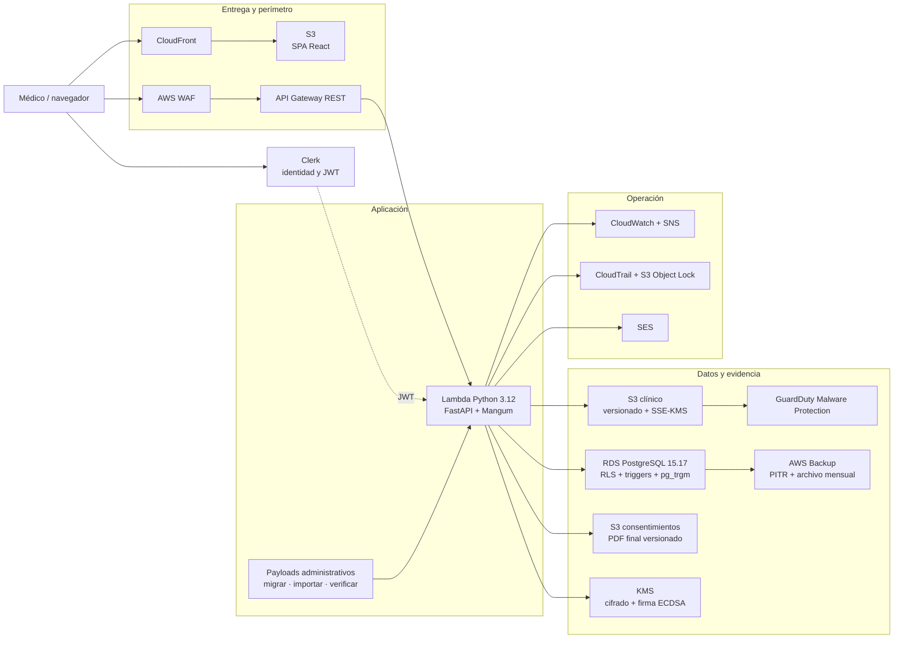
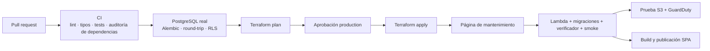

# CloudMedRecord

CloudMedRecord es un SaaS de expediente clínico electrónico para médicos independientes y consultorios pequeños en México. Este repositorio público documenta cómo está construido el producto, las decisiones que gobiernan su arquitectura y el estado verificable de su evolución.

> [!IMPORTANT]
> Este repositorio es una referencia técnica e informativa. No es un *starter kit*, una distribución para autoalojamiento ni una guía de instalación. La publicación del código tampoco equivale a una certificación normativa ni concede por sí misma una licencia de uso, copia o redistribución.

**Corte de esta descripción:** 16 de julio de 2026. Las Fases 0–5 del roadmap están integradas y desplegadas; las Fases 3–5 cuentan además con evidencia operativa específica de rollout o verificación en producción.

## Qué hace hoy

El producto cubre el flujo clínico principal desde la identidad profesional hasta la conservación de evidencia:

- onboarding del médico, perfil profesional y credenciales múltiples;
- pacientes, expedientes, antecedentes, agenda y encuentros clínicos;
- notas médicas y recetas con snapshot de identidad, firma ECDSA y verificación pública;
- catálogo CIE-10 mexicano con 14,486 códigos, búsqueda sin acentos y diagnósticos múltiples por nota;
- archivos clínicos mediante carga directa a S3, cuota por plan y descarga condicionada al escaneo antimalware;
- consentimientos basados en plantillas versionadas e inmutables;
- paciente o representante, testigos, selección de credencial, PDF final único y revocación lateral;
- bitácora de operaciones por tenant, observabilidad y verificadores de invariantes aptos para producción.

CloudMedRecord está **diseñado para apoyar** controles asociados con NOM-004-SSA3-2012, NOM-024-SSA3-2012 y privacidad de datos personales. No se presenta como producto certificado ni como sustituto de una evaluación clínica, jurídica, de seguridad o regulatoria independiente.

## Estado real del roadmap

| Fase | Entrega | Estado al corte | Evidencia principal |
|---|---|---|---|
| 0 | CI sobre migraciones reales, verificadores post-deploy y saneamiento de RLS | Activa en CI y operación | [Walkthrough Fase 0](WALKTHROUGH_FASE0.md) |
| 1 | Médicos, credenciales, adaptador único de firma y doble escritura transitoria | Desplegada | [Walkthrough Fase 1](WALKTHROUGH_FASE1.md) |
| 2 | Encuentros, primera vez/subsecuente y conflicto 409 conciliable | Backend y cliente desplegados; integración visual completa aún pendiente | [Walkthrough Fase 2](WALKTHROUGH_FASE2.md) |
| 3 | CIE-10 completo y diagnósticos estructurados create-only | Desplegada y verificada en producción el 15-jul-2026 | [Walkthrough Fase 3](WALKTHROUGH_FASE3.md) |
| 4 | Motor versionado de plantillas de consentimiento | Desplegada; cinco plantillas v1.0 publicadas y verificadas el 16-jul-2026 | [Walkthrough Fase 4](WALKTHROUGH_FASE4.md) · [rollout](https://github.com/franciscofloresen/expedienteMedicoSaaS/actions/runs/29465543238) |
| 5 | Firmantes, testigos, PDF final, verificación y revocación | Desplegada el 16-jul-2026; migración, verificador y smoke test verdes | [Walkthrough Fase 5](WALKTHROUGH_FASE5.md) · [deploy](https://github.com/franciscofloresen/expedienteMedicoSaaS/actions/runs/29468100667) |
| 6–8 | Biblioteca normativa ampliada, especialidades y estabilización | Planeadas; existen avances transversales, pero no están cerradas como fases | [Roadmap V2](ROADMAP_CLINICO_SIN_INCREMENTO_AWS_V2.md) |
| 9–16 | Confianza, continuidad, seguridad clínica, equipos, portabilidad y experiencia del paciente | Roadmap; no deben interpretarse como funciones disponibles | [Roadmap V2](ROADMAP_CLINICO_SIN_INCREMENTO_AWS_V2.md) |

Los walkthroughs narran el estado al terminar cada rama y por eso algunos todavía dicen “pendiente de despliegue”. La tabla anterior incorpora el estado posterior observado en `main` y en GitHub Actions.

Cuando una nota histórica o un comentario de código contradice al sistema actual, este README prioriza —en ese orden— los recursos Terraform/Alembic vigentes, la implementación ejecutable, las pruebas y la evidencia de workflows completados.

## Arquitectura desplegada

CloudMedRecord mantiene deliberadamente un monolito modular: una SPA, una API, una base relacional y servicios administrados de AWS. Los límites de dominio están en módulos y transacciones, no en microservicios de red.



La infraestructura actual es RDS PostgreSQL sobre `aws_db_instance`; no usa Aurora, Cognito ni RDS Proxy. Tampoco hay Kubernetes, Redis, OpenSearch, Kafka o una plataforma separada de feature flags.

## Stack comprobado

| Capa | Implementación actual |
|---|---|
| Frontend | React 19.2, TypeScript 6, Vite 8, React Router 7, TanStack Query 5 y CSS propio |
| API | FastAPI, Python 3.12, Pydantic 2, SQLAlchemy 2 asíncrono y AsyncPG |
| Ejecución | AWS Lambda de 1,024 MB / 30 s detrás de API Gateway, adaptada con Mangum |
| Identidad | Clerk; el backend valida el JWT y deriva el tenant desde claims/metadata |
| Base de datos | RDS PostgreSQL 15.17, `db.t4g.small`, gp3 20 GB con autoescalado hasta 100 GB |
| Búsqueda clínica | `pg_trgm`, columna normalizada en Python e índice GIN sobre CIE-10 |
| Evidencia | KMS simétrica para cifrado, KMS asimétrica ECDSA P-256 para firmas, SHA-256 y tokens públicos |
| Objetos | S3 privado y versionado para archivos clínicos, PDFs de consentimiento, frontend y auditoría |
| Infraestructura | Terraform 1.7+, módulos de red, seguridad, storage, base de datos, compute, observabilidad, SES y CDN |
| Entrega | GitHub Actions con OIDC hacia AWS, CI, aprobación de `production`, Terraform plan/apply y despliegue con página de mantenimiento |

## Decisiones arquitectónicas que definen el sistema

### 1. El tenant se aplica dentro de la transacción

El navegador no decide a qué tenant pertenece una operación. `TenantMiddleware` obtiene `tenant_id` del JWT de Clerk; `get_db` degrada la conexión al rol no-superusuario `medrecord_app` y ejecuta, dentro de la transacción:

```text
JWT válido
  → request.state.tenant_id
  → SET LOCAL ROLE medrecord_app
  → set_config('app.current_tenant', tenant_id, true)
  → políticas PostgreSQL RLS
```

`SET LOCAL` evita que el contexto de un tenant sobreviva al commit/rollback y se filtre a una conexión reutilizada. Las tablas tenant-scoped se descubren y verifican en producción; las tablas clínicas críticas usan `FORCE ROW LEVEL SECURITY` como defensa adicional.

### 2. La evidencia firmada no se reescribe

Una nota firmada queda bloqueada por trigger. Las capacidades posteriores se modelan hacia afuera:

- `nota_diagnosticos` apunta a la nota sin modificarla;
- la relación con encuentros se escribe al crear notas nuevas, no como backfill de notas firmadas;
- firmantes, documento final y revocación del consentimiento viven en tablas laterales;
- una revocación invalida el token público, pero no altera el original ni reemplaza su PDF.

Esta regla evita que una migración aparentemente aditiva cambie evidencia histórica y también condiciona el diseño de Alembic.

### 3. PostgreSQL protege invariantes, no sólo persiste datos

Las reglas sensibles a concurrencia están en la base:

- índice único parcial para una sola `primera_vez` completada por paciente y tenant;
- índice único parcial para un diagnóstico principal por nota;
- una credencial predeterminada activa por médico;
- una versión publicada por plantilla;
- un solo documento final y una sola revocación por consentimiento;
- `REVOKE DELETE` y triggers anti-borrado en evidencia clínica.

La API traduce las colisiones esperables —por ejemplo, dos primeras consultas completadas concurrentemente— a contratos de error estructurados y conciliables.

### 4. Identidad profesional separada del consultorio

`medicos` y `medico_credenciales` desacoplan a la persona que firma del tenant. Notas, recetas y consentimientos consumen el mismo adaptador de credencial y guardan un snapshot de nombre, cédula y especialidad al firmar. Los campos legados de `tenants` continúan en doble escritura durante la transición; retirarlos pertenece a una fase posterior.

### 5. Dos usos distintos de KMS

- Una llave simétrica cifra campos seleccionados directamente desde la aplicación con `tenant_id` como *Encryption Context*; RDS y S3 mantienen además cifrado en reposo.
- Una llave asimétrica ECDSA P-256 firma el hash SHA-256 de una representación canónica que incluye contenido, tenant, documento, identidad profesional y timestamp.

En desarrollo se usa una clave efímera local para la firma y un sustituto de cifrado para pruebas; esos mecanismos no representan la ruta de producción.

### 6. Catálogos e importaciones no viven dentro de Alembic

Alembic crea esquema, constraints, índices, RLS y triggers. Los datos voluminosos o editoriales —CIE-10 y plantillas— se preparan como artefactos, se validan con `dry-run` y se importan mediante payloads administrativos de la Lambda. Los workflows de producción agregan aprobación, snapshot previo, aplicación idempotente y verificación posterior.

### 7. Un documento final significa un objeto final

Los borradores permanecen en PostgreSQL. Al finalizar un consentimiento se genera una sola firma KMS y un único PDF bajo una key S3 determinista. Imprimir o verificar reutiliza el mismo `VersionId`; no vuelve a firmar, renderizar o escribir un documento alterno.

Los archivos clínicos ordinarios siguen otro flujo: presigned POST, validación de tamaño/tipo, cuota transaccional, SSE-KMS, escaneo GuardDuty y URL de descarga de corta duración sólo cuando el objeto es apto.

### 8. La migración real es parte de la prueba

La suite rápida usa modelos SQLAlchemy, pero triggers, grants y RLS provienen de Alembic. Por eso CI mantiene una segunda red que:

1. levanta PostgreSQL 15;
2. ejecuta `alembic upgrade head`;
3. prueba `downgrade -1` seguido de `upgrade head`;
4. verifica RLS y permisos;
5. corre las pruebas marcadas `migration_schema` contra ese esquema real.

Después del despliegue, el registro unificado ofrece verificadores read-only y sin PHI para `rls`, `medicos`, `encuentros`, `cie10`, `plantillas`, `consentimientos` y `backups`.

## Modelo de dominio

| Área | Entidades principales | Regla relevante |
|---|---|---|
| Cuenta profesional | `tenants`, `medicos`, `medico_credenciales` | identidad y credencial se preservan como snapshot al firmar |
| Expediente | `pacientes`, `expedientes`, `clinical_files` | aislamiento por tenant y baja lógica/evidencia protegida |
| Atención | `citas`, `encuentros_clinicos` | una cita cancelada no cuenta como atención; primera vez se decide al completar |
| Documentación | `notas`, `nota_diagnosticos`, `recetas` | create-only para relaciones nuevas; firma vuelve inmutable el documento |
| Consentimiento | `consentimientos`, `consentimiento_firmantes`, `consentimiento_documentos_finales`, `consentimiento_revocaciones` | finalización única, PDF único, revocación lateral |
| Catálogos compartidos | `cie10`, `consentimiento_plantillas`, `consentimiento_plantilla_versiones` | referencia global; publicación administrativa e inmutable |
| Trazabilidad | `audit_log`, `verification_tokens` | bitácora append-only y verificación pública sin revelar PHI |

## Seguridad, conservación y evidencia

La seguridad está distribuida en capas, no concentrada en una sola herramienta:

| Objetivo | Control implementado |
|---|---|
| Autenticación | JWT de Clerk; rutas públicas reducidas y documentación de API deshabilitada en producción |
| Autorización tenant | rol PostgreSQL de mínimo privilegio, contexto transaccional y RLS por tabla |
| Integridad clínica | contenido canónico, SHA-256, firma ECDSA, snapshots de identidad y triggers de inmutabilidad |
| Borrado | permisos sin `DELETE`, triggers anti-borrado y bajas lógicas en evidencia clínica |
| Auditoría | `AuditMiddleware` persiste método, ruta, estado, duración, IP y request ID en `audit_log` append-only; CloudTrail cubre actividad AWS |
| Archivos | buckets privados, bloqueo de acceso público, versionado, SSE-KMS, URLs breves y escaneo antimalware |
| Perímetro | WAF con reglas administradas, protección SQLi/entradas conocidas y rate limit por IP |
| Recuperación | PITR de RDS por 35 días y snapshots mensuales retenidos 1,825 días en AWS Backup Vault Lock |
| Detección | alarmas de Lambda, API, RDS, DLQ, auditoría y fallos de backup/restore vía CloudWatch/SNS |

Existe evidencia documentada de un primer restore real de RDS con RTO aproximado de 17 minutos y RPO cercano a cero. Esto prueba un procedimiento concreto, no garantiza por sí solo todos los SLO futuros; los simulacros periódicos y validaciones de contenido siguen en el roadmap.

La [matriz viva de cumplimiento](docs/compliance_matrix.md) distingue `no evaluado`, `parcial`, `implementado` y `verificado independiente`. Ningún control se declara verificado independientemente todavía.

## Operación y entrega

El pipeline actual sigue esta secuencia:



La rama principal más reciente auditada tuvo CI y CD exitosos el 16-jul-2026. En esta revisión local también pasaron Ruff, MyPy, 40 pruebas unitarias, ESLint, TypeScript y el build de producción. El build frontend conserva una deuda visible: el chunk principal ronda 793.5 kB minificado (222.9 kB gzip) y Vite recomienda dividirlo.

## Límites y trabajo pendiente

El estado honesto del producto incluye estas brechas:

- la UI general de encuentros todavía no conecta toda la experiencia de primera vez/evolución, aunque el modelo, API y cliente existen;
- sólo están publicadas las cinco plantillas base; la biblioteca de 19 y su revisión clínica/jurídica pertenecen a Fase 6;
- la autorización sigue optimizada para un médico por tenant; roles `propietario`, `medico` y `recepcion` son Fase 14;
- MFA obligatorio, reautenticación sensible, hardening completo de claims JWT, threat model y pentest independiente son Fase 9;
- addenda formal, alergias, problemas, medicamentos longitudinales, signos vitales tipados e idempotencia transversal son Fase 12;
- no hay todavía exportación portable completa, flujo ARCO técnico integral ni interoperabilidad FHIR de salida;
- no existe una suite Playwright E2E completa ni evidencia WCAG 2.2 AA; ambas pertenecen a la fase de calidad;
- no se mantiene un staging 24/7; el roadmap propone entornos efímeros para migraciones de riesgo y simulacros;
- el catálogo CIE-10 guarda `CIE-10-MX` como versión constante; una entidad formal de releases sigue pendiente;
- el objetivo de costo de USD 150/mes es una restricción de diseño y planeación, no una cotización ni una afirmación del gasto observado.

## Mapa del repositorio

| Ruta | Contenido |
|---|---|
| [`frontend/`](frontend/) | SPA, rutas públicas/protegidas, flujos clínicos, impresión y verificación |
| [`backend/app/`](backend/app/) | API, modelos, middleware, servicios de dominio, catálogos y configuración |
| [`backend/alembic/`](backend/alembic/) | evolución real del esquema, RLS, permisos, índices y triggers |
| [`backend/scripts/`](backend/scripts/) | importadores idempotentes, verificadores y operaciones controladas |
| [`backend/tests/`](backend/tests/) | pruebas unitarias, integración, seguridad y esquema migrado |
| [`terraform/`](terraform/) | infraestructura AWS modular y estado objetivo de producción |
| [`.github/workflows/`](.github/workflows/) | CI/CD y workflows operativos aprobados |
| [`docs/`](docs/) | matriz normativa, runbooks, material legal y decisiones históricas |

## Ruta de lectura recomendada

1. [Roadmap clínico y de producto V2](ROADMAP_CLINICO_SIN_INCREMENTO_AWS_V2.md) — restricciones, fases, costo y arquitectura objetivo.
2. [Walkthroughs de Fase 0](WALKTHROUGH_FASE0.md), [1](WALKTHROUGH_FASE1.md), [2](WALKTHROUGH_FASE2.md), [3](WALKTHROUGH_FASE3.md), [4](WALKTHROUGH_FASE4.md) y [5](WALKTHROUGH_FASE5.md) — decisiones y evidencia de cada incremento.
3. [Matriz viva de cumplimiento](docs/compliance_matrix.md) — controles, evidencia y riesgo residual sin estados binarios autoproclamados.
4. [Runbook de respaldo y retención](docs/runbooks/backup_retention_5years.md) y [rollout CIE-10](docs/runbooks/cie10_production_rollout.md) — ejemplos de operación verificable.

## Sobre el carácter público del repositorio

El propósito de publicar este código es mostrar el razonamiento técnico y la evolución del producto. Por eso este README no incluye credenciales, variables de entorno, comandos de instalación, instrucciones para clonar ni procedimientos de despliegue de terceros.

Al corte de esta auditoría el repositorio no contiene un archivo `LICENSE`. En consecuencia, este documento no otorga permiso de uso, modificación o redistribución. Cualquier autorización debe obtenerse expresamente del titular del proyecto.
